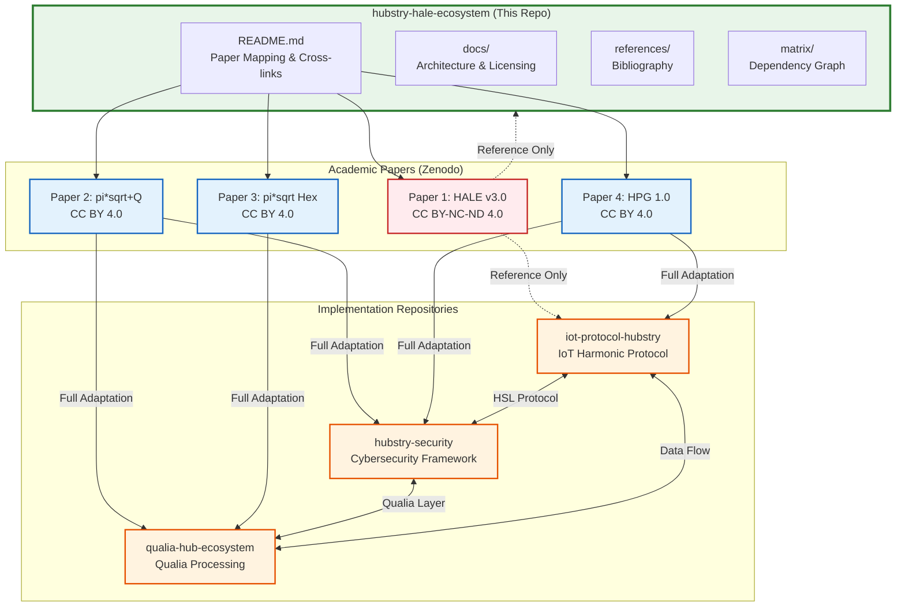

# Hubstry HALE Ecosystem

> **Meta-Framework** | Ecossistema Integrado de Pesquisa e Desenvolvimento
>
> Central hub that unifies 4 academic papers and cross-links 3 specialized
> repositories under the Hubstry Harmonic framework.

[](https://creativecommons.org/licenses/by/4.0/)
[](https://doi.org/10.5281/zenodo.18901934)

---
## Incrementos / Latest Implementations

| M�dulo | Arquivo | Descri��o |
|--------|---------|-----------|
| **HALE Pipeline** | hale_core/hale_equation.py | Pipeline: f0 - H - h - ? - c - M - g |
| **Fun��es ?1-?4** | hale_core/psi_functions.py | 4 fun��es de endere�amento selecion�veis |
| **Omnigrid 2D** | hpg_core/omnigrid.py | Grade O_N = H_N � {-1,+1} com Euler |
| **HPM 1.0** | hpg_core/hpm_config.py | 12 canais harm�nicos (f0=16.384 kHz) |
| **Sinal s(t) + FFT** | hpg_core/signal_processing.py | Sinal composto + decodifica��o FFT |
| **Verifica��o Espectral** | hpg_core/spectral_verification.py | Integridade de raz�es racionais |
| **HSL Auth** | security/hsl_auth.py | H-Challenge/Response 3 etapas (~200B) |
| **Detec��o de Intrus�o** | security/intrusion_detection.py | Desvio de fase ?? > ? |
| **Rota��o LFSR** | security/key_rotation.py | Rota��o de chaves via LFSR |
| **?-Radical Operator** | pi_radical/pi_radical.py | Operador ?-radical - 6 rela��es ??-?? |
| **Lattice 64 Perfis** | pi_radical/lattice_profiles.py | Lattice de 64 perfis harm�nicos |
| **W Matrix Fixed-Point** | pi_radical/w_matrix.py | Matriz W - ponto fixo espectral |
| **Bound ?? Qu�ntico** | pi_radical/quantum_bound.py | Limite qu�ntico ?? |
| **HALE Demo** | demo/hale_demo.py | Demonstra��o interativa HALE |


## �YO� Visão Geral / Overview

### Português

O **Hubstry HALE Ecosystem** é o repositório meta-framework que serve como hub central
de referência para todas as 4 publicações acadêmicas e integra os 3 repositórios
especializados do ecossistema Hubstry. Este repositório mapeia as contribuições
de cada paper, estabelece a arquitetura de integração e garante a conformidade
licenciosa entre os componentes.

### English

The **Hubstry HALE Ecosystem** is the meta-framework repository serving as the central
reference hub for all 4 academic publications and integrating the 3 specialized
repositories of the Hubstry ecosystem. This repository maps each paper contribution,
establishes the integration architecture, and ensures license compliance across components.

---

## �Y"" Paper Mapping / Mapeamento de Publicações

| Paper | DOI | License | Repo(s) | Integration Type |
|-------|-----|---------|---------|-----------------|
| HALE v3.0 Working Paper | [10.5281/zenodo.18901934](https://doi.org/10.5281/zenodo.18901934) | CC BY-NC-ND 4.0 | iot-protocol-hubstry, hale-ecosystem | Reference only |
| pi*sqrt+Q Quantum Computation | [10.5281/zenodo.18776462](https://doi.org/10.5281/zenodo.18776462) | CC BY 4.0 | qualia-hub-ecosystem, hubstry-security | Full adaptation |
| pi*sqrt Hexa-Relational Algebra | [10.5281/zenodo.18776401](https://doi.org/10.5281/zenodo.18776401) | CC BY 4.0 | qualia-hub-ecosystem | Full adaptation |
| HPG 1.0 Harmonic Protocol Grid | [10.5281/zenodo.19056387](https://doi.org/10.5281/zenodo.19056387) | CC BY 4.0 | iot-protocol-hubstry, hubstry-security | Full adaptation |

---

## �Y"- Cross-Linked Repositories / Repositórios Vinculados

| Repository | Description | Primary Papers |
|------------|-------------|----------------|
| [iot-protocol-hubstry](https://github.com/guilherme-machado-ceo/iot-protocol-hubstry) | IoT Harmonic Protocol implementation with post-quantum security | HALE v3.0, HPG 1.0 |
| [hubstry-security](https://github.com/guilherme-machado-ceo/hubstry-security) | Cybersecurity framework with harmonic signal layer | pi*sqrt+Q, HPG 1.0 |
| [qualia-hub-ecosystem](https://github.com/guilherme-machado-ceo/qualia-hub-ecosystem) | Qualia processing with hexa-relational algebra | pi*sqrt+Q, pi*sqrt Hex |

---

## �Y"o License Compatibility Matrix

| Paper | License | Commercial Use | Modification | Distribution | Derivatives |
|-------|---------|----------------|--------------|--------------|-------------|
| HALE v3.0 | **CC BY-NC-ND 4.0** | �O Non-commercial only | �O No derivatives | �o. With attribution | �O No derivatives allowed |
| pi*sqrt+Q | **CC BY 4.0** | �o. Yes | �o. Yes | �o. With attribution | �o. With same license |
| pi*sqrt Hex | **CC BY 4.0** | �o. Yes | �o. Yes | �o. With attribution | �o. With same license |
| HPG 1.0 | **CC BY 4.0** | �o. Yes | �o. Yes | �o. With attribution | �o. With same license |

> **Note**: Paper 1 (HALE v3.0) uses CC BY-NC-ND 4.0, meaning its content can only be
> **cited and referenced** �?" never modified or used as a basis for derivative works.
> Papers 2-4 use CC BY 4.0, allowing full adaptation and derivative works with attribution.

---

## �Y�-️ Ecosystem Architecture / Arquitetura do Ecossistema



---

## �Y", Repository Structure / Estrutura do Repositório

```
hubstry-hale-ecosystem/
�"o�"?�"? README.md                          # This file - bilingual overview
�"o�"?�"? LICENSE                            # CC BY 4.0
�"o�"?�"? docs/
�",   �"o�"?�"? paper-mapping.md               # Detailed paper-to-repo mapping
�",   �"o�"?�"? ecosystem-architecture.md      # Full architecture with diagrams
�",   �""�"?�"? license-guide.md               # License compatibility guide
�"o�"?�"? references/
�",   �""�"?�"? bibliography.bib               # BibTeX entries for all 4 DOIs
�""�"?�"? matrix/
    �""�"?�"? dependency_graph.py            # Dependency graph generator
```

---

## �Y�� Mathematical Foundations / Fundamentos Matemáticos

The ecosystem is grounded in the **HALE (Harmonic Addressing & Labeling Equation)**
framework and its extensions:

- **HALE Core**: Harmonic signal processing for IoT addressing and labeling
- **pi*sqrt(f(A))**: Mathematical framework combining pi with square root of
  functional analysis applied to quantum computation
- **Hexa-Relational Algebra**: Six-dimensional relational algebra for qualia
  processing and knowledge representation
- **HPG (Harmonic Protocol Grid)**: Grid-based protocol architecture for
  harmonic communication in IoT networks

---

## �Y�� Contribuição / Contributing

This is an academic meta-framework repository. Contributions should follow
the license constraints of the referenced papers:

1. **Paper 1 (HALE v3.0)**: Can only be cited/referenced �?" no derivative works
2. **Papers 2-4**: Derivative works allowed with proper attribution under CC BY 4.0

See [docs/license-guide.md](docs/license-guide.md) for full details.

---

## �Y"- Citation / Citação

When referencing this ecosystem, please cite all relevant papers:

```bibtex
@misc{hale-ecosystem-2025,
  author    = {Machado, Guilherme},
  title     = {{Hubstry HALE Ecosystem: Meta-Framework}},
  year      = {2025},
  publisher = {GitHub},
  url       = {https://github.com/guilherme-machado-ceo/hubstry-hale-ecosystem}
}
```

---

## �Y"< Badges

<p align="center">
  
  
  
  
</p>

---

<p align="center">
  <strong>Hubstry HALE Ecosystem</strong><br/>
  <em>Harmonic Architecture for Linked Ecosystems</em><br/>
  <a href="https://github.com/guilherme-machado-ceo">guilherme-machado-ceo</a> | 2025
</p>