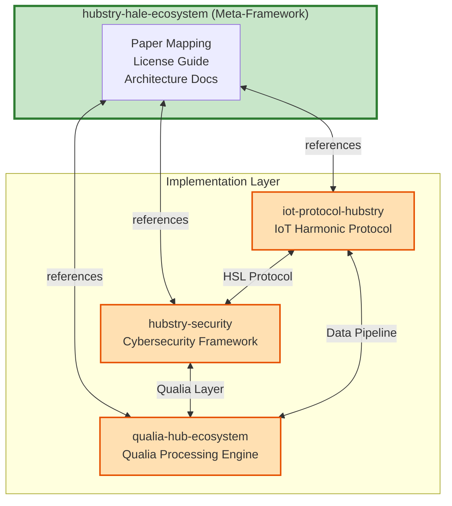
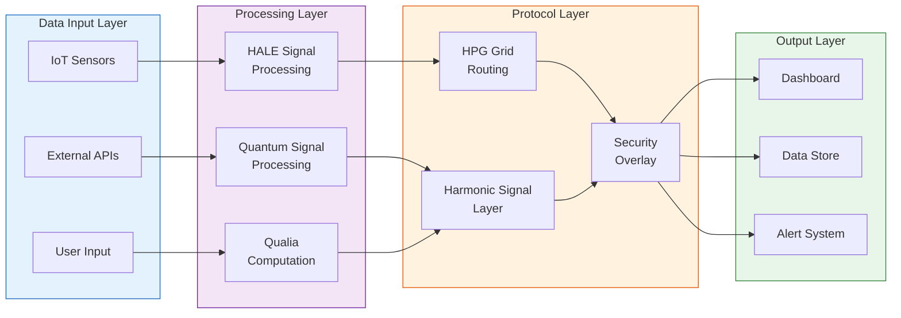
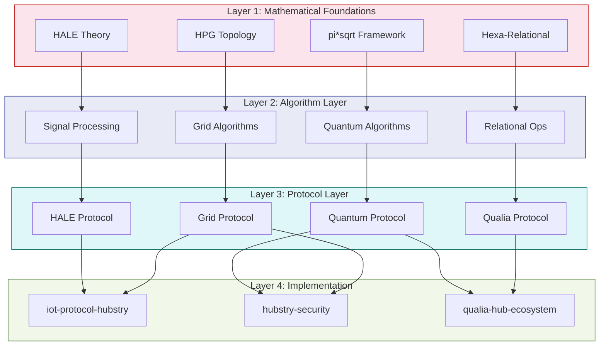
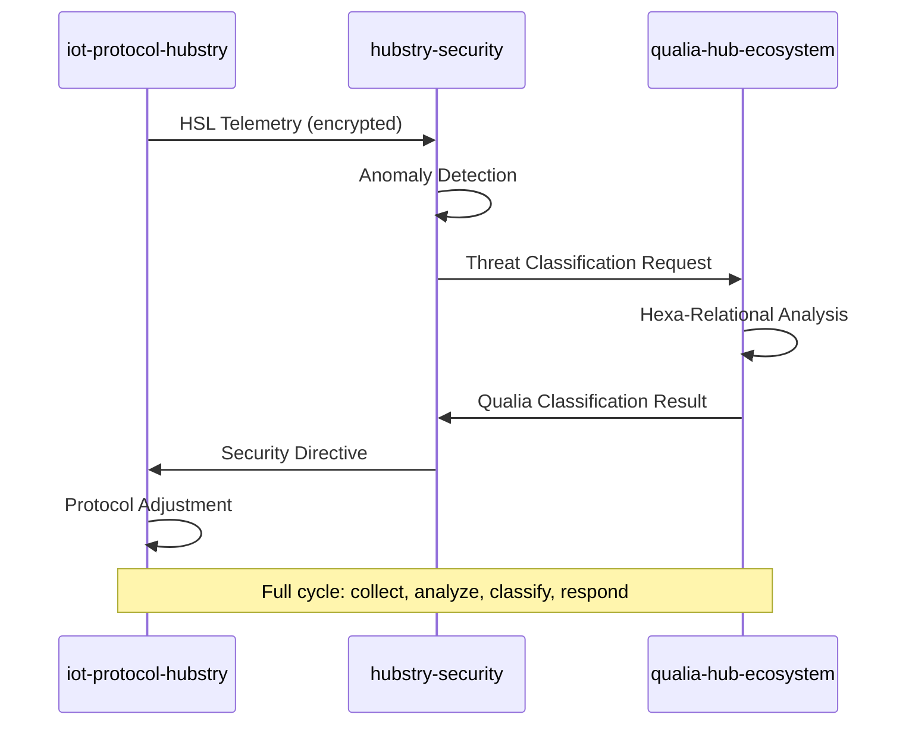
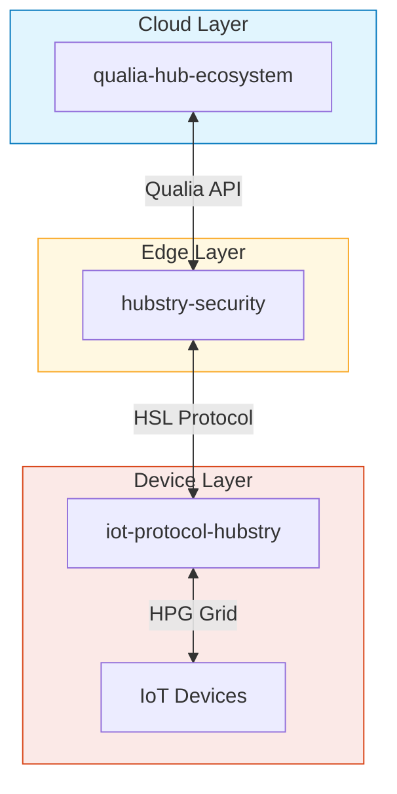

# Ecosystem Architecture

> Full architectural documentation for the Hubstry HALE Ecosystem,
> including relationship diagrams, data flow, and shared mathematical foundations.

---

## 🏛️ Overview

The Hubstry HALE Ecosystem is organized as a meta-framework with a central hub
repository (this repo) that orchestrates three specialized implementation
repositories. Each repository implements specific aspects of the theoretical
foundations laid out in four academic papers.

---

## 🔄 Repository Relationships



---

## 📊 Data Flow Architecture



---

## 🧮 Shared Mathematical Foundations

### Core Mathematical Pillars

```mermaid
mindmap
  root((Mathematical<br/>Foundations))
    HALE Framework
      Harmonic Signal Processing
      Address Resolution
      Label Assignment
      Resource Mapping
    pi*sqrt(f(A))
      Pi Constant Integration
      Square Root Functional
      Functional Analysis
      Quantum State Mapping
    Hexa-Relational Algebra
      6D Relational Model
      Multi-dimensional Joins
      Qualia Space Mapping
      Semantic Binding
    HPG Protocol Grid
      Grid Topology Theory
      Harmonic Routing
      Node Registration
      Failover Mechanics
```

### Mathematical Convergence Points

The four papers converge on several shared mathematical concepts:

| Concept | Paper 1 | Paper 2 | Paper 3 | Paper 4 |
|---------|---------|---------|---------|---------|
| Harmonic functions | ✅ Core | ✅ Extended | ◐ Partial | ✅ Core |
| Functional analysis | ◐ Partial | ✅ Core | ✅ Core | ◐ Partial |
| Multi-dimensional mapping | ◐ Partial | ✅ Core | ✅ Core | ✅ Core |
| Quantum mechanics | ❌ | ✅ Core | ◐ Partial | ◐ Partial |
| Protocol design | ✅ Core | ◐ Partial | ❌ | ✅ Core |
| Relational algebra | ❌ | ◐ Partial | ✅ Core | ❌ |

---

## 🏗️ Layered Architecture



---

## 🔗 Inter-Repository Communication

### Communication Patterns

| From | To | Protocol | Data Type | Frequency |
|------|----|----------|-----------|-----------|
| iot-protocol-hubstry | hubstry-security | HSL (Harmonic Signal Layer) | Encrypted telemetry | Real-time |
| hubstry-security | qualia-hub-ecosystem | Qualia API | Anomaly patterns | Event-driven |
| qualia-hub-ecosystem | iot-protocol-hubstry | Data Pipeline | Semantic data | Batch + Stream |
| iot-protocol-hubstry | hubstry-security | HPG Overlay | Grid state | Periodic |

### Shared Interfaces



---

## 📁 Implementation Mapping

### iot-protocol-hubstry
- **Primary Papers**: Paper 1 (ref), Paper 4 (full)
- **Core Modules**: HALE Signal Processing, HPG Grid, Device Management
- **Mathematical Foundation**: Harmonic functions, Grid topology

### hubstry-security
- **Primary Papers**: Paper 2 (full), Paper 4 (full)
- **Core Modules**: Quantum-Safe Primitives, HPG Security Overlay, Threat Analysis
- **Mathematical Foundation**: Quantum computation, Harmonic routing

### qualia-hub-ecosystem
- **Primary Papers**: Paper 2 (full), Paper 3 (full)
- **Core Modules**: Qualia Processing, Hexa-Relational Engine, Semantic Layer
- **Mathematical Foundation**: pi*sqrt(f(A)), 6D relational algebra

---

## 🚀 Deployment Topology



This three-tier topology ensures that computational intensity decreases from
cloud (qualia processing) through edge (security analysis) to device (harmonic
protocol handling).